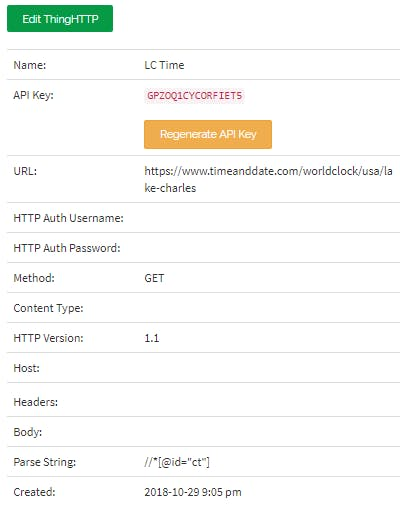
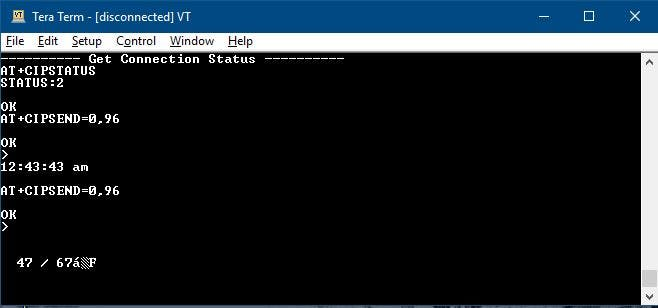

# HUD Alarm Clock
The code in this repo supports the HUD Alarm Clock project I developed using an mbed microcontroller.

## Background
This project arose from my interest in IOT. I wanted to start a basic project that integrated network connectivity with something relatively cool.

Every day, I have the same morning routine. Before I get out of bed, I check the time, then the weather - always in that order. I decided to combine these two tasks into one and have some fun in the process.

Thus the HUD alarm clock idea was born.

## Idea
The alarm clock gets its weather and time from two different websites which I linked through ThingSpeak APIs. The current temperature and time are then displayed on the semi-reflective screen.

In its current design, the HUD is several times better in low light settings. I am currently searching for a way to ensure the HUD is also visible in bright light.

The system will connect to the internet via an ESP8266 wifi module. The alarm times will be set with code, while the alarm will sound from a small speaker.

The ESP8266 is not breadboard-friendly, so I had to solder jumpers onto the module.

The time and weather are accessed through a ThingSpeak API which can isolate parts of webpages and locate them on the ThingSpeak server for easy access. The process is outlined below:

## Weather and Time via ThingHTTP
In order to get the weather and time to the mBed, I used the ThingHTTP app from ThingSpeak to strip the desired information from a single web page.
1. To set up the simple web page that contains the time, a ThingHTTP app will need to be set up.
2. In ThingSpeak, go to the Apps toolbar and select ‘ThingHTTP.’
3. Select ‘New ThingHTTP, ’ give it an appropriate name - ‘LC Time’ in this example.
4. You will need to provide the URL of the target page: https://www.timeanddate.com/worldclock/usa/lake-charles.
5. Set Method to ‘GET, ’ and HTTP Version to 1.1. The last piece needed is the Parse String. To obtain this, navigate to the URL as above
6. The target component of the webpage is the time as displayed below:

7. Right-click anywhere on the page and select ‘Inspect.’ This will provide an additional pane with the html code for the current web page. It takes some inspection to find the portion that displays the time on the page as highlighted below:

8. Right-click this section of code and select ‘Copy XPath.’
9. Navigate back to the open ThingHTTP tab and paste this XPath into the Parse String field. This is all that is necessary to set up an API to access the time on the web page. Your ThingHTTP setup should bear some resemblance to the figure below

10. Once this is saved, there should be a toolbar to the right of the page showing ‘GET https://api.thingspeak.com/apps/…’ You can confirm that the procedure up to this point has worked by copying this path and going to it in your browser. The response should be similar to below

11. For the weather, the ThingHTTP process is the same. The only difference is that the data is sourced from slightly lower in the web page.

12. The target is the high and low for the day. Inspect the page to find the target area and copy the XPath.

13. Use a second ThingHTTP app with all the same parameters, but be sure to use the right Parse String for the weather. Check that this has been successful by navigating to the *https://api.thingspeak.com/apps/…* link that is generated. The result should be similar to that below:

  You have now set up the API’s for easy access to the necessary information.

## Testing
I included photos of the terminal output during the testing stage.

## Challenges
1. The ESP-01 is not breadboard friendly, so jumper wires needed to be soldered on to provide proper connectivity.
2. The project was initially planned to be deployed on the Arduino Uno MCU with the ESP-01 providing WiFi capabilities. This presented a fairly simple issue - the Uno outputs 5V, but the ESP-01 runs on 3.3V. The proposed solution was to buy a bi-directional logic level converter (bi-di converter) to carry out the necessary logic level conversions between both boards.
3. Upon purchase and implementation of the converter, it was found that the converter had continuity issues. It is unclear whether this problem arose from my soldering, or if it was a defective board from the start.
4. The inability to use the bi-di converter made it unreliable to use the Arduino Uno in the project, and because I already had an mBed microcontroller which naturally outputs at 3.3V, I decided to switch the main board to the mBed NXP LPC1768.
5. Once a connection with the ThingSpeak server was made and the desired information could be reliably printed to the PC terminal, I attempted to connect the LCD and print out the data there. A new problem then reared its head - the connection with the server became unviable.
6. A ‘link error’ has been displayed on every connection attempt in the last 48 hours. I do not believe it is a result of the code or hardware as the same setup was used with success in the past. This is still being worked on at this time.

**Note**: It has since been discovered that the ESP can run on 5V from the Arduino as a professor at my university used the ESP in such a setup as of this time. It seems that connecting the Vcc pin to 5V instead of 3.3V might cause the ESP to take and output 5V logic levels. I have not tested this approach and neither encourage nor discourage it.

## Links/Credits
1. Simple tutorial by Jim Hamblen on wiring and code connecting the ESP8266 to the WLAN: https://os.mbed.com/users/4180_1/notebook/using-the-esp8266-with-the-mbed-lpc1768/
2. Information for connecting the GPIO pins: http://www.forward.com.au/pfod/ESP8266/GPIOpins/index.html
3. ESP8266 header files: https://os.mbed.com/teams/ESP8266/code/esp8266-driver/
4. Website used for time and date: https://www.timeanddate.com/worldclock/usa/lake-charles
5. Common AT commands for the ESP: https://github.com/espressif/ESP8266_AT/wiki
6. LCD Data Sheet: https://www.arduino.cc/documents/datasheets/LCDscreen.PDF
